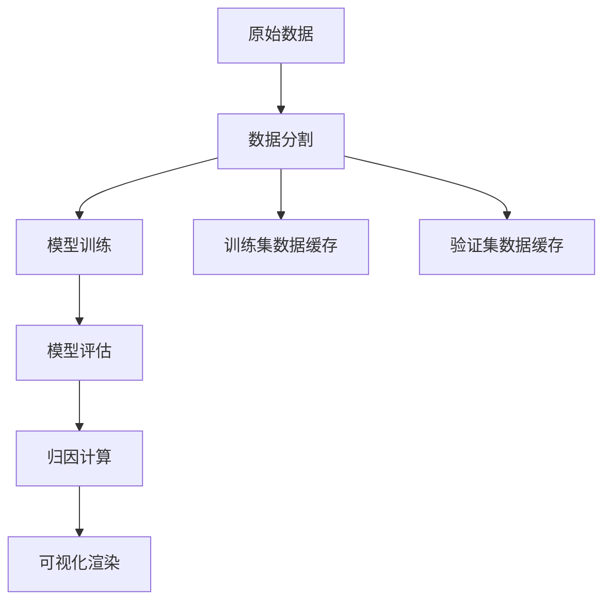

# 轨迹预测与归因分析流水线

本项目实现了从数据分割到可视化渲染的完整轨迹预测归因分析流程。支持多种深度学习模型(AutoBot, MTR, SMART, Wayformer)和归因方法(AttnLRP, IntegratedGradients, Saliency等)。

## 🚀 完整流程概览



## 📋 运行流程

### 1. 数据分割阶段

**脚本**: `exps_scripts/unitraj_train_eval/data_merge_split.py`

**功能**: 将原始数据集合并并按比例分割为训练集和验证集

**输入**:
- 原始数据集目录 (默认: `D:\datasets\nuscenes_scn\nuscenes_Traj`)
- 配置参数:
  - `train_ratio`: 训练集比例 (默认: 0.8)
  - `exclude`: 需要排除的数据集名称

**输出**:
- `dataset_traj/scn_merged/`: 合并后的完整数据集
- `dataset_traj/scn_split_train/`: 训练集数据
- `dataset_traj/scn_split_val/`: 验证集数据

**运行命令**:
```bash
cd exps_scripts/unitraj_train_eval
python data_merge_split.py
```

**配置修改**:
- 修改脚本内的 `base_dir` 变量指定源数据路径
- 调整 `train_ratio` 改变训练/验证集比例
- 修改 `exclude` 列表排除特定数据集

### 2. 模型训练阶段

**脚本**: `exps_scripts/unitraj_train_eval/train_torch.py`

**功能**: 使用分割后的数据训练轨迹预测模型

**输入**:
- 训练数据: `dataset_traj/scn_split_train/`
- 验证数据: `dataset_traj/scn_split_val/`
- 配置文件: `configs/config.yaml`

**输出**:
- 模型权重: `weights/TrajAttr_ckpt/{exp_name}/best_model.ckpt`
- 训练日志: `weights/TrajAttr_ckpt/logs/{exp_name}/`
- 缓存数据: `cache/scn_split_train/` 和 `cache/scn_split_val/`

**运行命令**:
```bash
cd exps_scripts/unitraj_train_eval
python train_torch.py
```

**配置修改**:
- 修改 `configs/config.yaml`:
  - `method`: 选择模型类型 (autobot, MTR, SMART, wayformer)
  - `exp_name`: 实验名称
  - `devices`: GPU设备编号
  - `max_epochs`: 训练轮数
  - `train_batch_size`/`eval_batch_size`: 批次大小

### 3. 模型评估阶段

**脚本**: `exps_scripts/unitraj_train_eval/evaluation_torch.py`

**功能**: 评估训练好的模型并生成预测结果

**输入**:
- 验证数据: `dataset_traj/scn_split_val/`
- 训练好的模型: `weights/TrajAttr_ckpt/{exp_name}/best_model.ckpt`
- 配置文件: `configs/config.yaml`

**输出**:
- 评估结果: `exps_scripts/unitraj_train_eval/evaluation_output/evaluation_results_{model}.json`
- 预测轨迹: `exps_scripts/unitraj_train_eval/evaluation_output/predictions_{model}_world_coords.json`

**运行命令**:
```bash
cd exps_scripts/unitraj_train_eval
python evaluation_torch.py
```

### 4. 归因计算阶段

**脚本**: `exps_scripts/exp_trajattr/compute_traj_attr.py`

**功能**: 计算模型预测的归因分析结果

**输入**:
- 验证数据: `dataset_traj/scn_split_val/`
- 训练好的模型: `weights/TrajAttr_ckpt/{exp_name}/best_model.ckpt`
- 配置文件: `configs/traj_attr_base.yaml`

**输出**:
- 归因结果: `exps_res/res_trajattr/{model}_{dataset}/attributions/numpy/{method}/`
  - `*_obj_trajs.npy`: 智能体轨迹归因
  - `*_map_polylines.npy`: 地图元素归因

**运行命令**:
```bash
cd exps_scripts/exp_trajattr
python compute_traj_attr.py
```

**配置修改**:
- 修改 `configs/traj_attr_base.yaml`:
  - `method`: 选择基础模型配置
  - `attribution.methods`: 选择归因方法 ["AttnLRP", "IntegratedGradients", "Saliency"]
  - `attribution.batch_limit`: 计算的批次数量
  - `model_attr`: 选择模型特定归因配置
  - `attnlrp_lib`: 选择AttnLRP方法配置

### 5. 可视化渲染阶段

**脚本**: `vis_scripts/` 目录下的可视化脚本

**功能**: 渲染归因分析结果的可视化界面

**输入**:
- 验证数据: `dataset_traj/scn_split_val/`
- 预测结果: `evaluation_output/predictions_{model}_world_coords.json`
- 归因结果: `exps_res/res_trajattr/{model}_{dataset}/attributions/numpy/{method}/`
- 配置文件: `vis_scripts/visualization_defaults.yaml`

**输出**:
- 交互式可视化界面
- 叠加归因热图的场景渲染

**运行命令**:
```bash
cd vis_scripts
python main_visualization_script.py
```

**配置修改**:
- 修改 `vis_scripts/visualization_defaults.yaml`:
  - `database_path`: 场景数据路径
  - `prediction_path`: 预测结果路径
  - `attribution.numpy_dir`: 归因结果目录
  - `attribution.enabled`: 是否启用归因可视化
  - `attribution.opacity`: 归因热图透明度
  - `attribution.threshold`: 归因值显示阈值

## ⚙️ 配置文件切换指南

### 模型切换

**位置**: `configs/config.yaml` 和 `configs/traj_attr_base.yaml`

**可选模型**:
- `autobot`: AutoBot模型
- `MTR`: Motion Transformer
- `SMART`: SMART模型  
- `wayformer`: Wayformer模型

**切换方法**:
```yaml
# configs/config.yaml
defaults:
  - method: autobot  # 改为 MTR, SMART, wayformer

# configs/traj_attr_base.yaml  
defaults:
  - method: autobot  # 保持一致
```

### 归因方法切换

**位置**: `configs/traj_attr_base.yaml`

**可选方法**:
- `AttnLRP`: 注意力层相关传播
- `CP-AttnLRP`: 合成传播注意力LRP
- `IntegratedGradients`: 积分梯度
- `Saliency`: 显著性分析
- `DeepLift`: DeepLIFT归因

**切换方法**:
```yaml
# configs/traj_attr_base.yaml
attribution:
  methods: ["AttnLRP"]  # 单个方法
  # methods: ["AttnLRP", "IntegratedGradients"]  # 多个方法
```

### 数据集切换

**位置**: `configs/config.yaml` 和 `configs/traj_attr_base.yaml`

```yaml
# 训练/验证数据路径
train_data_path: ["dataset_traj/scn_split_train"]
val_data_path: ["dataset_traj/scn_split_val"]

# 或使用样本数据
# train_data_path: ["data_samples/nuscenes"]
# val_data_path: ["data_samples/nuscenes"]
```

### 可视化配置切换

**位置**: `vis_scripts/visualization_defaults.yaml`

**归因方法目录切换**:
```yaml
attribution:
  numpy_dir: "exps_res/res_trajattr/autobot_nuscenes/attributions/numpy/AttnLRP"
  # 切换为其他方法:
  # numpy_dir: "exps_res/res_trajattr/autobot_nuscenes/attributions/numpy/IntegratedGradients"
```

## 📁 主要目录结构

```
project_0/
├── configs/                    # 配置文件
│   ├── config.yaml            # 主配置文件
│   ├── traj_attr_base.yaml    # 归因分析配置
│   ├── method/                # 模型配置
│   └── attribution/           # 归因方法配置
├── exps_scripts/              # 实验脚本
│   ├── unitraj_train_eval/    # 训练评估脚本
│   └── exp_trajattr/          # 归因计算脚本
├── vis_scripts/               # 可视化脚本
├── models/                    # 模型实现
├── utils_attr/                # 归因分析工具
├── dataset_traj/              # 数据集(分割后)
├── cache/                     # 数据缓存
├── weights/                   # 模型权重
└── exps_res/                  # 实验结果
```

## 🔧 常见问题

### Q: 如何更改训练集/验证集比例？
A: 修改 `data_merge_split.py` 中的 `train_ratio` 变量，重新运行数据分割脚本。

### Q: 如何使用不同的归因方法？
A: 修改 `configs/traj_attr_base.yaml` 中的 `attribution.methods` 列表。

### Q: 如何更改模型？
A: 修改 `configs/config.yaml` 和 `configs/traj_attr_base.yaml` 中的 `defaults.method` 字段。

### Q: 可视化无法显示归因结果？
A: 检查 `vis_scripts/visualization_defaults.yaml` 中的 `attribution.numpy_dir` 路径是否正确。

### Q: GPU内存不足？
A: 减小 `batch_size` 或在配置中设置 `debug: True` 使用CPU模式。

## 📄 许可证

本项目遵循相应的开源许可证。详情请参考各组件的许可证文件。